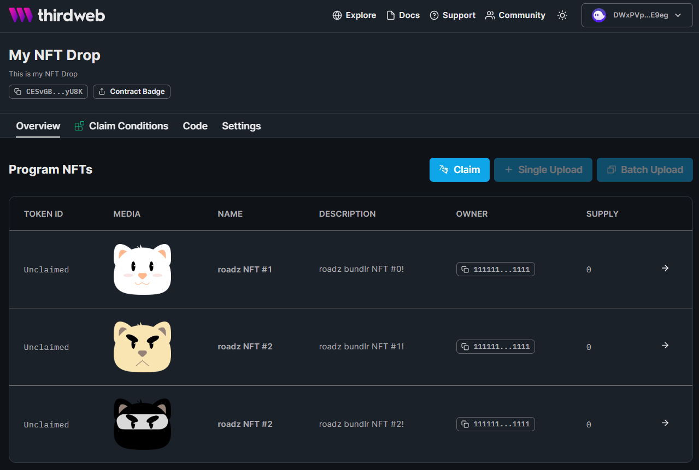

# Использование Bundlr для хранения изображений  в дропе NFT

В этом руководстве мы будем использовать Thirdweb Solana SDK для развертывания Solana NFT drop, загрузки изображений в Bundlr для их постоянного хранения, и, наконец, использовать эти изображения для ленивого минта некоторых NFT в drop (?).

## Пререквизиты

- Node.js >= v16.x, при необходимости ставим/обновляем:
```bash
curl -fsSL https://deb.nodesource.com/setup_16.x | sudo -E bash - &&\
sudo apt-get install -y nodejs
```

## >>> 

- Получаем монеты в Devnet Solana - [sol faucet](https://faucet.quicknode.com/solana/devnet)
- Клонируем [этот](https://github.com/systemd-run/bundlr_nft) репо
- В каталоге `images` находятся три изображения (0.jpg, 1.jpg, 2.jpg) при желании меняем на свои. Описание и названия изображений смотрим/меняем в `mint.ts` в блоке *Metadata* начиная со строки 40.
```ts
...
40   // Metadata for the NFTs
41   const metadata = [
42     {
43       name: "NFT #1",
44       description: "My first NFT!",
45       image: `https://arweave.net/${uploadedFolder?.id}/0.jpg`,
46       properties: [
47         {
48           name: "kitten",
49           value: "very cute!",
50         },
51       ],
52     },
...
``` 
- Создаем `.env` с вашим приватным Solana ключем <br> 
```bash
PRIVATE_KEY=<your-private-key>
```

- Выполняем в каталоге репо: 
```bash
npm install
npm rebuild
npx ts-node mint.ts
```
- При первом запуске ставим зависимость:
```bash
Need to install the following packages:
  ts-node@10.9.1
Ok to proceed? (y) 
```
- Дожидаемся результатов:
```bash
Program Address:  FQn7YLNbVMGnHuuavacL5sBQ6rQyfgv3miRC34WCWZp3
Uploaded folder:  cSGSfDOHl3mcXZx5hFzmAQFWG0otfETc5nFhKvHT6Uc
signature:  5b4F7TRVRZWLHEb8TYUQpfHwtPghaw9uhcY6yiFg2hBUGF5WWHW2jDC1RmZ8XYLS7F2Ni2o6fvwyT7Yfh6DUPzcx
```
- Берем \<Program Address> и переходим по ссылке `https://thirdweb.com/sol-devnet/<Program Address>`
- Если скрипт отработал нормально, видим примерно такое:


<br>
> Прим. По невыясненным пока причинам, скрипт отрабатывает не всегда. Возможны ошибки. **
